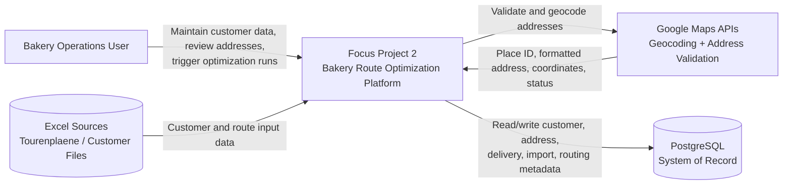

# C4 - System Context

## Purpose
Defines the system boundary, external actors, and external systems.

## Scope (MVP)
The system supports bakery delivery planning from customer master data through address validation and route optimization preparation.

## System Context Diagram

## Actors and External Systems
- `Bakery Operations User`: Maintains records, corrects addresses, starts optimization flow.
- `Google Maps APIs`: Provides address validation and geocoding results.
- `PostgreSQL`: Stores core domain entities and import/geocoding state.
- `Excel Sources`: Input files used for manual/batch data onboarding in MVP.

## Key Interactions
1. User enters or imports customer/delivery data into the platform.
2. Platform validates and geocodes addresses via Google Maps APIs.
3. Platform persists normalized records and statuses in PostgreSQL.
4. User triggers optimization based on validated and geocoded records.
