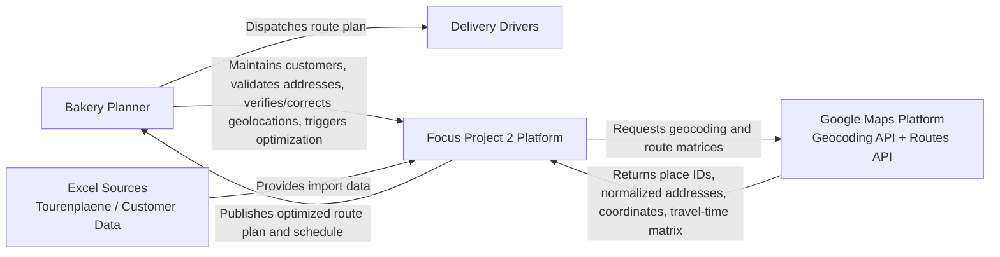

# C4 - System Context

## Purpose
Defines the system boundary, primary users, and external systems interacting with the bakery optimization platform.

## Scope
The platform supports the operational flow from customer data onboarding to route optimization:

1. Customer and delivery data import and cleansing.
2. Address validation, geolocation verification/correction in the UI, and geocoding.
3. Travel-time matrix retrieval from external map services.
4. CVRPTW optimization using the optimization engine.
5. Delivery schedule publication for bakery operations.

## System Context Diagram

## Actors and External Systems
- `Bakery Planner`: Maintains data, verifies/corrects geolocations in UI, launches optimization runs, and reviews results.
- `Delivery Drivers`: Consume finalized route plans from operations.
- `Google Maps Platform`: External provider for geocoding and route-matrix travel times.
- `PostgreSQL`: Persistent store for customer/address/delivery/import/geocoding/optimization data.
- `Excel Sources`: Upstream operational input files for onboarding and updates.

## Key Interactions
1. Operations imports or maintains customer and delivery constraints.
2. Platform validates addresses and supports UI-based geolocation verification/correction.
3. Platform requests geocoding/place IDs and then a travel-time matrix from Google Maps APIs.
4. Optimization engine solves CVRPTW with time windows (OR-Tools) using cleaned constraints + matrix.
5. Platform stores run outputs and exposes route/schedule results to operations for dispatch.
