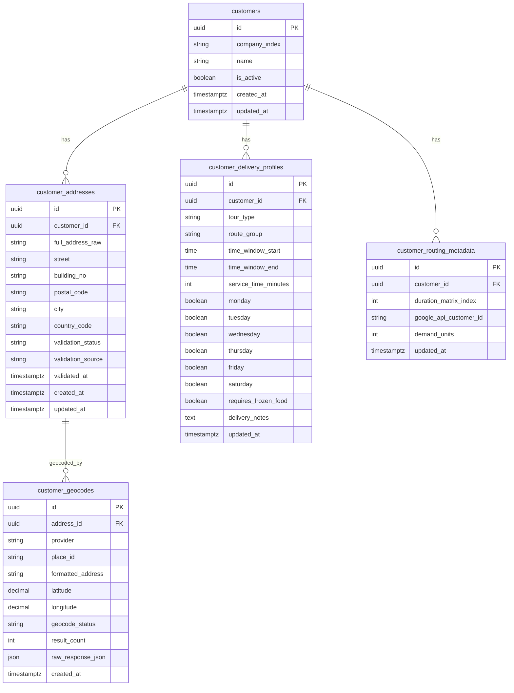

# Database Structure (PostgreSQL)

## Purpose
This document defines the initial relational schema for the fixed customer dataset, address validation/geocoding workflow, and optimization readiness for a **Capacitated Vehicle Routing Problem with Time Windows (CVRPTW)**.

## Core Entities
- `customers`: business identity (company/customer level)
- `customer_addresses`: raw + normalized address, validation state
- `customer_geocodes`: geocoding result history (place_id, lat/lng, status)
- `customer_delivery_profiles`: time windows, weekday flags, notes, frozen goods flag
- `customer_routing_metadata`: matrix index and optimization-related metadata

## ER Diagram (Mermaid)

## Data Flow
1. Team enters customer/address/delivery records directly in PostgreSQL.
2. Address validation/geocoding updates status before optimization eligibility.
3. Validated and geocoded records provide the operational input needed for CVRPTW optimization.
