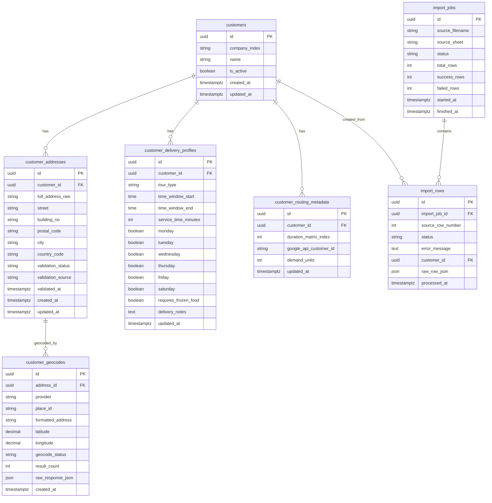

# Database Structure (PostgreSQL)

## Purpose
This document defines the initial relational schema for the customer import, address validation/geocoding workflow, and optimization readiness.

## Core Entities
- `customers`: business identity (company/customer level)
- `customer_addresses`: raw + normalized address, validation state
- `customer_geocodes`: geocoding result history (place_id, lat/lng, status)
- `customer_delivery_profiles`: time windows, weekday flags, notes, frozen goods flag
- `customer_routing_metadata`: matrix index and optimization-related metadata
- `import_jobs`: optional import tracking (for future automated import)
- `import_rows`: optional row-level import status/error tracking

## ER Diagram (Mermaid)

## Data Flow (Current and Future)
### Current (manual entry)
1. Team enters customer/address/delivery records directly in PostgreSQL.
2. Address validation/geocoding updates status before optimization eligibility.

### Future (automated import)
1. Data import creates an `import_jobs` record.
2. Each parsed line is tracked in `import_rows`.
3. Valid mapped records create/update `customers` and `customer_addresses`.
