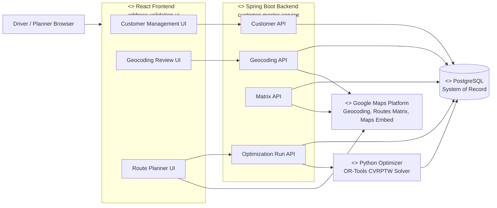
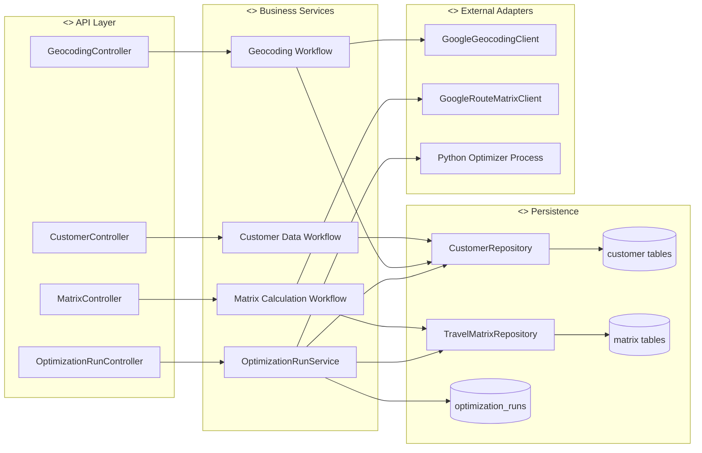
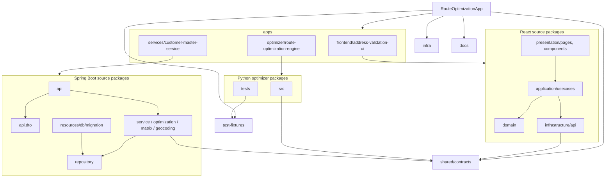
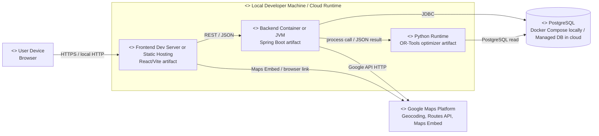
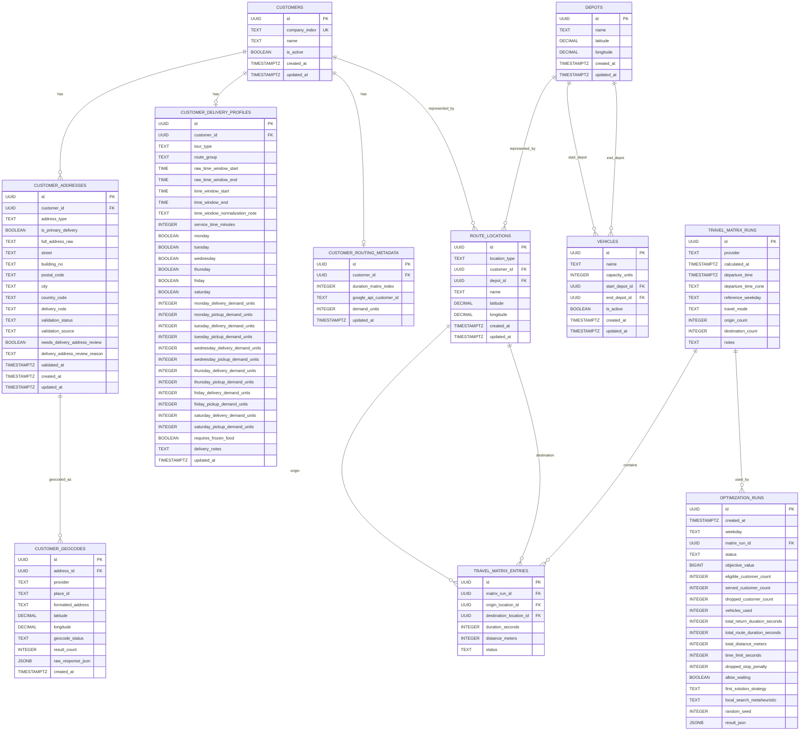

# UML and ER Diagrams

These Mermaid diagrams are source diagrams for documentation and for recreating the same views in Enterprise Architect.

The UML interpretation follows the UML book found in `../uml-models.pdf`:

- Building block view: use a UML Component Diagram.
- Source-code organization: use a UML Package Diagram.
- Runtime/cloud view: use a UML Deployment Diagram.
- Database model: use an ER diagram, not a building block view.

## 1. Building Block View - UML Component Diagram

Use this as the main arc42 Bausteinsicht level 1.

Enterprise Architect recreation:

- Create a UML Component Diagram.
- Use UML Components for frontend, backend service, optimizer, database, and external Google Maps Platform.
- Use Dependency connectors for calls/uses relationships.
- Optionally model API contracts as provided/required interfaces.

## 2. Backend Building Block View - UML Component Diagram

Use this as a level 2 Bausteinsicht for the Spring Boot backend.

Enterprise Architect recreation:

- Create a UML Component Diagram.
- Represent controllers, services, repositories, external clients, and database tables as components.
- Use Dependency connectors from controllers to services and from services to repositories/clients.

## 3. Source Organization - UML Package Diagram

Use this if you want to show the code/package organization. This is not the same as the runtime architecture.

Enterprise Architect recreation:

- Create a UML Package Diagram.
- Use Packages for root folders and important source packages.
- Use Dependency connectors for imports/calls.

## 4. Runtime View - UML Deployment Diagram

Use this for local and cloud deployment documentation.

Enterprise Architect recreation:

- Create a UML Deployment Diagram.
- Use Nodes for browser, local machine/cloud runtime, containers, database, and external Google services.
- Deploy artifacts/components inside the nodes.
- Use Communication Path connectors for HTTP, JDBC, process invocation, and external API calls.

## 5. Database Model - ER Diagram

Use this as the data model diagram. This is separate from the UML Bausteinsicht.

Enterprise Architect recreation:

- Create a Data Modeling or ER diagram.
- Add entities/tables with primary keys and foreign keys.
- Use one-to-many relationships according to the foreign keys below.
- Keep detailed weekday demand columns in the `customer_delivery_profiles` entity or move them into a note if the diagram gets too wide.

