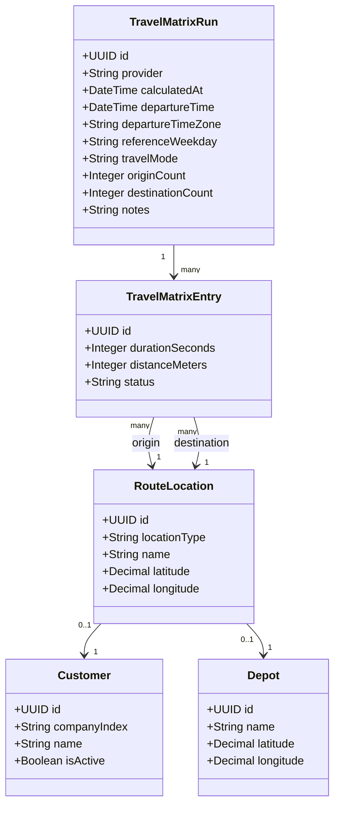
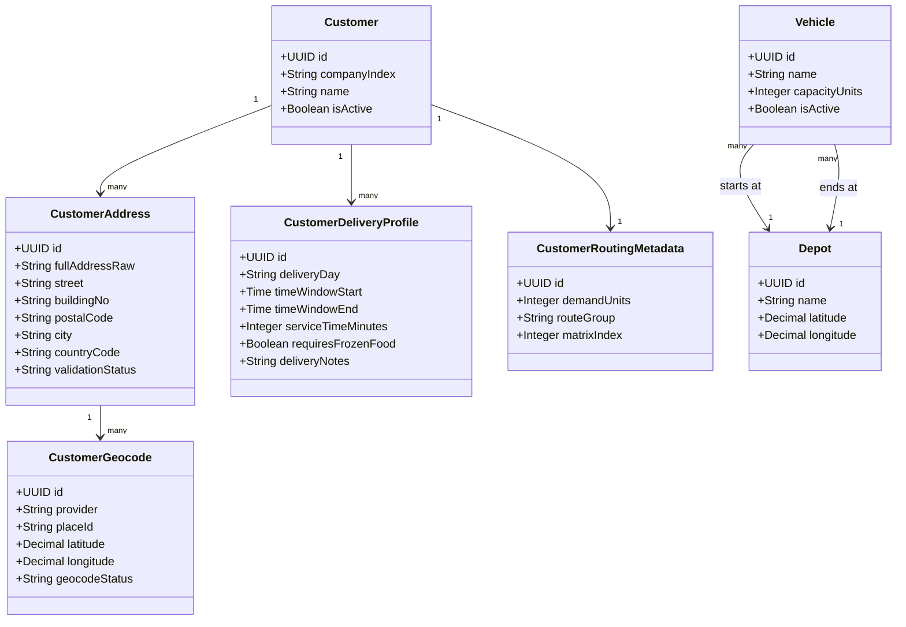

# Optimization Data Model Notes

## Purpose
This document captures the data model decisions that should later be transferred into Enterprise Architect class diagrams.
The model focuses on the data required to calculate and store a travel-time matrix and to provide input for CVRPTW route optimization.

## Travel-Time and Distance Matrix
Travel times must be modeled as **directed** values.
The duration from `A -> B` is not guaranteed to be the same as `B -> A` because of one-way streets, turn restrictions, different access roads, and traffic assumptions.

The platform should store travel time and distance in the same matrix entry because both values describe the same directed route segment returned by the maps provider.
The optimizer primarily needs `durationSeconds` for time-window constraints.
`distanceMeters` is stored as supporting data for reporting, plausibility checks, and later cost analysis.

For the project scope, one full matrix is calculated for the fixed customer dataset and depot.
The matrix is treated as delivery-day independent and later optimization runs reuse the persisted matrix by selecting only the customers active on the chosen weekday.
The first full matrix uses Google Routes API's default traffic-unaware routing behavior.
No representative `departureTime` is sent for this baseline matrix.
This keeps the full `93 x 93` matrix in the Routes Compute Route Matrix Essentials tier.
A later comparison run can use `TRAFFIC_AWARE_OPTIMAL` with a representative departure timestamp, but that matrix must be stored as a separate `travel_matrix_runs` record.
Google Routes matrix requests are sent in `10 x 10` origin-destination chunks so matrix calculation can be retried safely and remains compatible with the stricter traffic-aware request size limit.

For 92 customers and one depot, the persisted non-self directed route entries are:

```text
93 locations * 92 non-self destinations = 8,556 directed matrix entries
```

The Google Routes API calls use rectangular chunks, so the request workload can include self-pairs:

```text
93 origins * 93 destinations = 8,649 route matrix elements
```

Self-routes such as `A -> A` can be stored as zero values or ignored by the optimizer.

## Travel Matrix Class Diagram


The initial database tables for this model are documented separately in `docs/modeling/optimization-database-tables.md`.

## Customer, Vehicle, and Optimization Input Model
Google Maps Platform only provides geocoding, travel durations, and distances.
It does not model vehicle capacity and it does not solve the CVRPTW optimization problem.

Vehicle capacity and customer demand are handled by the platform and passed to OR-Tools.
The previous thesis states that the bakery operates two vans, and the legacy OR-Tools script uses `num_vehicles = 2`.
For the current project data model, initialize two active vehicles with `capacityUnits = 100`.
Because real delivery quantities are not yet available, initialize each customer with `demandUnits = 1`.

Example:

```text
Vehicle 1 capacity = 100 units
Vehicle 2 capacity = 100 units
Customer A demand = 30 units
Customer B demand = 40 units
Customer C demand = 50 units

Customer A + Customer B = 70 units, allowed
Customer A + Customer B + Customer C = 120 units, not allowed
```

A vehicle references a depot because each route must have a start location and usually an end location.
For the bakery use case, all vehicles will usually start and end at the same bakery depot.
Both vehicles are assumed to be available on every modeled delivery day.
The existing route groups from the source data are retained for review and reporting only.
They must not partition optimization runs.
For a selected weekday, the optimizer receives the full eligible customer set and decides how to assign stops to the two vehicles.

## Customer and Vehicle Class Diagram


The initial database tables for depots and vehicles are documented separately in `docs/modeling/optimization-database-tables.md`.

## Google Maps Platform Compatibility
This model works with Google Maps Platform because the Routes API Compute Route Matrix works with origins and destinations.
The platform can send depot and customer coordinates as origins and destinations and then store the returned duration and distance values as directed matrix entries.

Google Maps Platform provides:

```text
origin location
destination location
duration
distance
```

OR-Tools uses:

```text
duration matrix
customer time windows
customer demand units, initially 1 per customer by default
vehicle capacity units, initially 100 per vehicle by default
vehicle start and end depots
```

The optimizer combines two OR-Tools modeling concepts:

```text
Time dimension:
    duration matrix + service times + customer time windows

Capacity dimension:
    customer demandUnits + vehicle capacityUnits
```

The two systems are connected by the persisted matrix:

```text
Depot and customer coordinates
        -> Google Compute Route Matrix
        -> durationSeconds and distanceMeters
        -> PostgreSQL travel_matrix_entries
        -> OR-Tools CVRPTW optimizer
```
