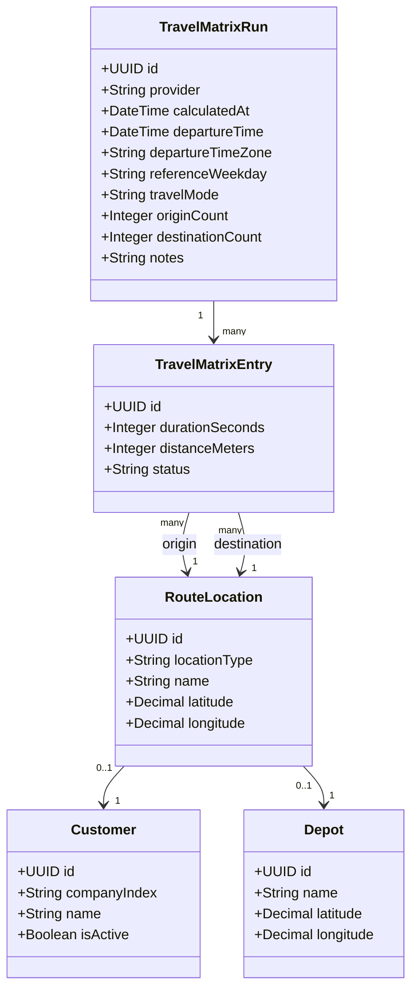
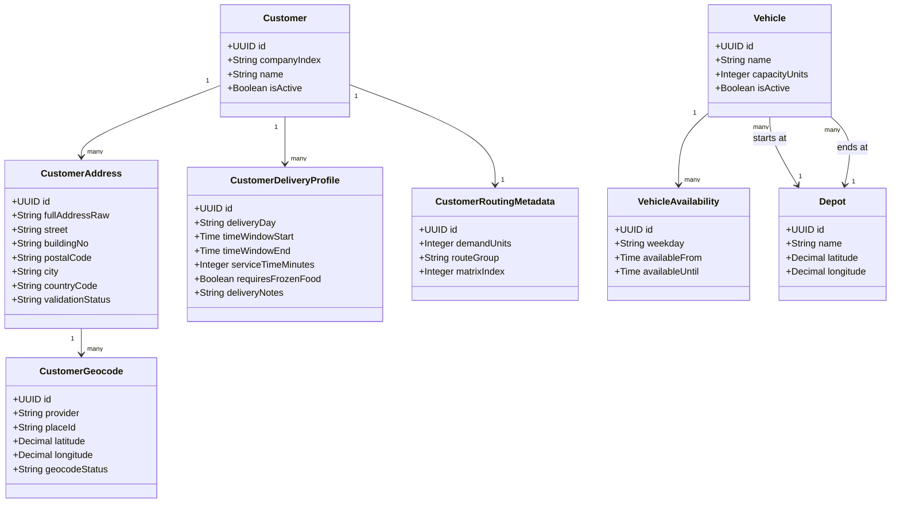

# Optimization Data Model Notes

## Purpose
This document captures the data model decisions that should later be transferred into Enterprise Architect class diagrams.
The model focuses on the data required to calculate and store a travel-time matrix and to provide input for CVRPTW route optimization.

## Travel-Time and Distance Matrix
Travel times must be modeled as **directed** values.
The duration from `A -> B` is not guaranteed to be the same as `B -> A` because of one-way streets, turn restrictions, different access roads, and traffic assumptions.

The platform should store travel time and distance in the same matrix entry because both values describe the same directed route segment returned by the maps provider.
The optimizer primarily needs `durationSeconds` for time-window constraints.
`distanceMeters` is stored as supporting data for reporting, plausibility checks, and later cost analysis.

For the project scope, one full matrix is calculated for the fixed customer dataset and depot.
The matrix is treated as delivery-day independent and later optimization runs reuse the persisted matrix by selecting only the customers active on the chosen weekday.
Google Routes API still requires a concrete `departureTime` for traffic-aware routing.
The representative traffic timestamp is Tuesday at 04:30 Europe/Zurich, because the tour plan shows depot departure around 04:20 and first customer stops around 04:30-05:00.

For 92 customers and one depot:

```text
93 locations * 92 non-self destinations = 8,556 directed matrix entries
```

Self-routes such as `A -> A` can be ignored or stored as zero values.

## Travel Matrix Class Diagram


## Travel Matrix Table Sketch
```sql
CREATE TABLE route_locations (
    id UUID PRIMARY KEY,
    location_type TEXT NOT NULL,
    customer_id UUID NULL,
    depot_id UUID NULL,
    name TEXT NOT NULL,
    latitude DECIMAL(10, 7) NOT NULL,
    longitude DECIMAL(10, 7) NOT NULL
);

CREATE TABLE travel_matrix_runs (
    id UUID PRIMARY KEY,
    provider TEXT NOT NULL,
    calculated_at TIMESTAMPTZ NOT NULL,
    departure_time TIMESTAMPTZ,
    departure_time_zone TEXT NOT NULL,
    reference_weekday TEXT NOT NULL,
    travel_mode TEXT NOT NULL,
    origin_count INTEGER NOT NULL,
    destination_count INTEGER NOT NULL,
    notes TEXT
);

CREATE TABLE travel_matrix_entries (
    id UUID PRIMARY KEY,
    matrix_run_id UUID NOT NULL REFERENCES travel_matrix_runs(id),
    origin_location_id UUID NOT NULL REFERENCES route_locations(id),
    destination_location_id UUID NOT NULL REFERENCES route_locations(id),
    duration_seconds INTEGER NOT NULL,
    distance_meters INTEGER,
    status TEXT,
    UNIQUE (matrix_run_id, origin_location_id, destination_location_id)
);
```

## Customer, Vehicle, and Optimization Input Model
Google Maps Platform only provides geocoding, travel durations, and distances.
It does not model vehicle capacity and it does not solve the CVRPTW optimization problem.

Vehicle capacity and customer demand are handled by the platform and passed to OR-Tools.

Example:

```text
Vehicle 1 capacity = 100 units
Customer A demand = 30 units
Customer B demand = 40 units
Customer C demand = 50 units

Customer A + Customer B = 70 units, allowed
Customer A + Customer B + Customer C = 120 units, not allowed
```

A vehicle references a depot because each route must have a start location and usually an end location.
For the bakery use case, all vehicles will usually start and end at the same bakery depot.

## Customer and Vehicle Class Diagram


## Vehicle Table Sketch
```sql
CREATE TABLE depots (
    id UUID PRIMARY KEY,
    name TEXT NOT NULL,
    latitude DECIMAL(10, 7) NOT NULL,
    longitude DECIMAL(10, 7) NOT NULL
);

CREATE TABLE vehicles (
    id UUID PRIMARY KEY,
    name TEXT NOT NULL,
    capacity_units INTEGER NOT NULL,
    start_depot_id UUID NOT NULL REFERENCES depots(id),
    end_depot_id UUID NOT NULL REFERENCES depots(id),
    is_active BOOLEAN NOT NULL DEFAULT TRUE
);

CREATE TABLE vehicle_availability (
    id UUID PRIMARY KEY,
    vehicle_id UUID NOT NULL REFERENCES vehicles(id),
    weekday TEXT NOT NULL,
    available_from TIME,
    available_until TIME
);
```

## Google Maps Platform Compatibility
This model works with Google Maps Platform because the Routes API Compute Route Matrix works with origins and destinations.
The platform can send depot and customer coordinates as origins and destinations and then store the returned duration and distance values as directed matrix entries.

Google Maps Platform provides:

```text
origin location
destination location
duration
distance
```

OR-Tools uses:

```text
duration matrix
customer time windows
customer demand units
vehicle capacity units
vehicle start and end depots
```

The two systems are connected by the persisted matrix:

```text
Depot and customer coordinates
        -> Google Compute Route Matrix
        -> durationSeconds and distanceMeters
        -> PostgreSQL travel_matrix_entries
        -> OR-Tools CVRPTW optimizer
```
